# aws-cognito-with-nextauth-using-nextjs

## AWS Cognito Configuration

[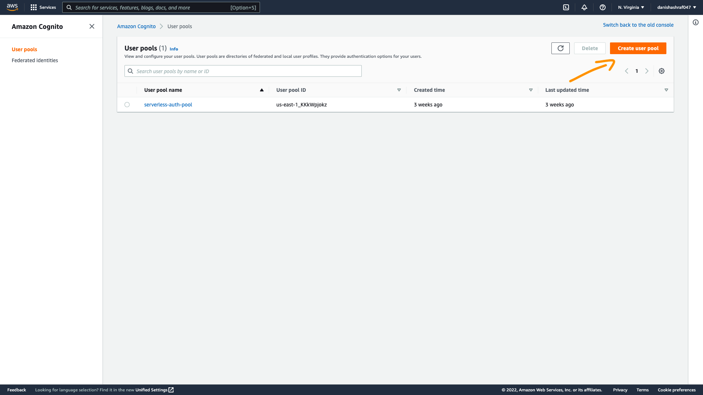](screenshots/screenshot-1.png)
[](screenshots/screenshot-2.png)
[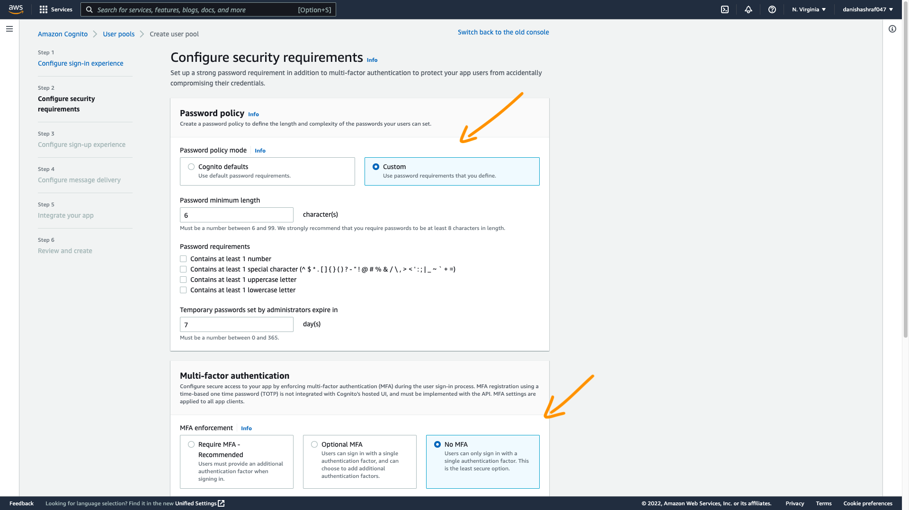](screenshots/screenshot-3.png)
[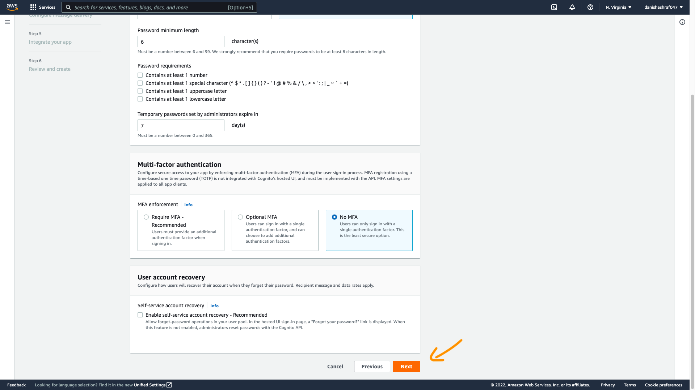](screenshots/screenshot-4.png)
[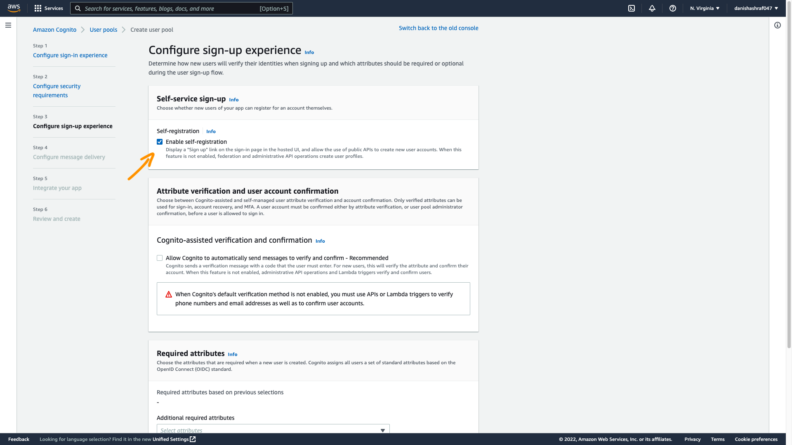](screenshots/screenshot-5.png)
[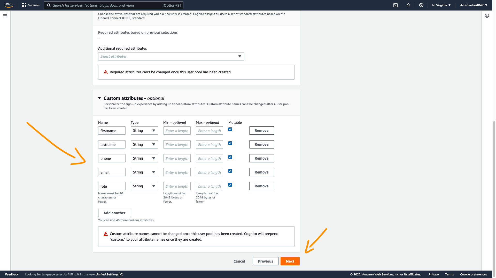](screenshots/screenshot-6.png)
[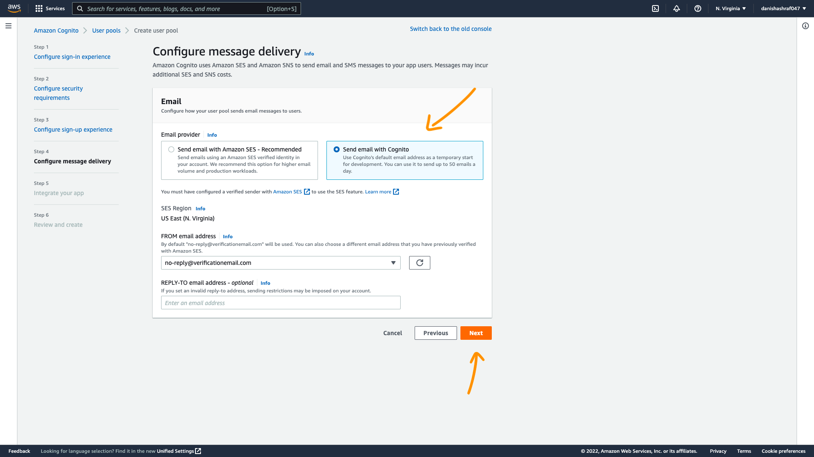](screenshots/screenshot-7.png)
[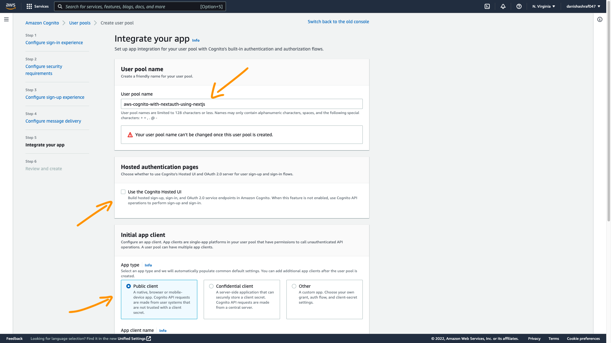](screenshots/screenshot-8.png)
[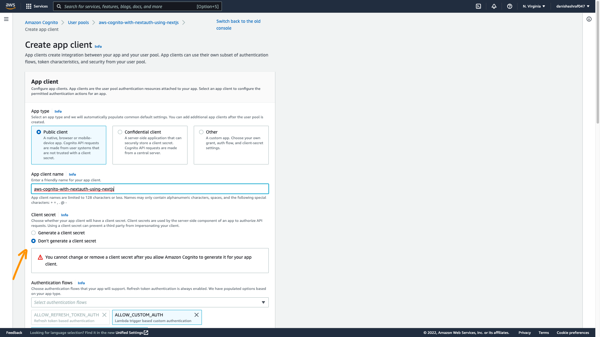](screenshots/screenshot-9.png)
[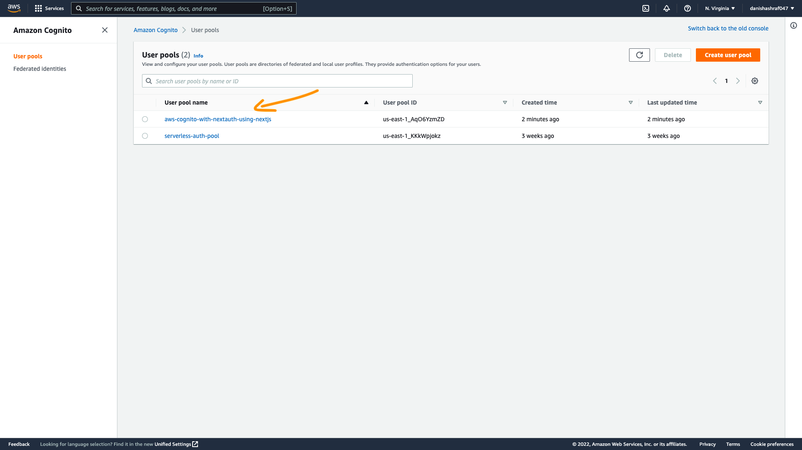](screenshots/screenshot-10.png)
[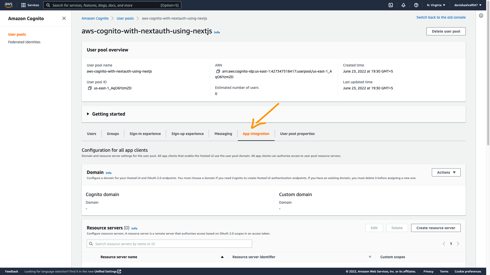](screenshots/screenshot-11.png)
[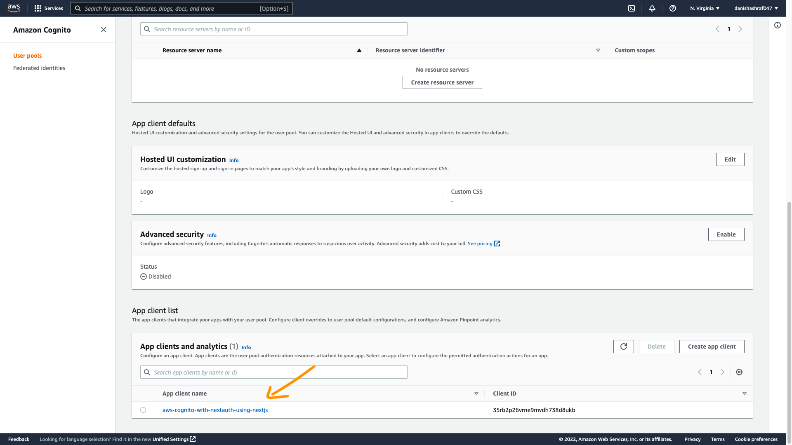](screenshots/screenshot-12.png)
[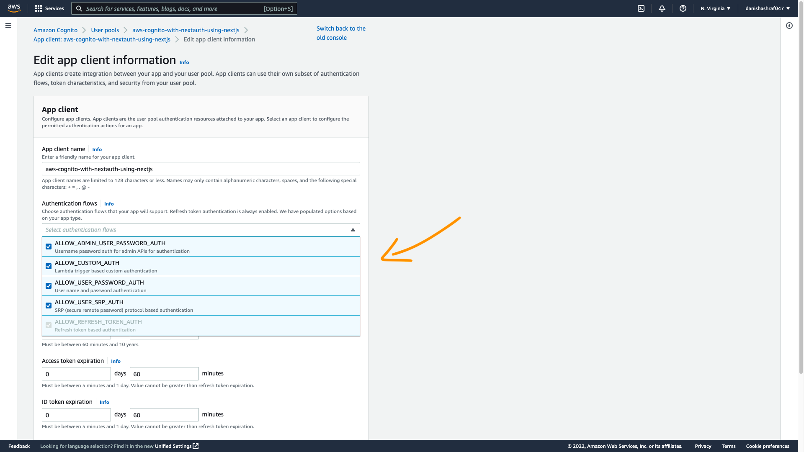](screenshots/screenshot-13.png)
[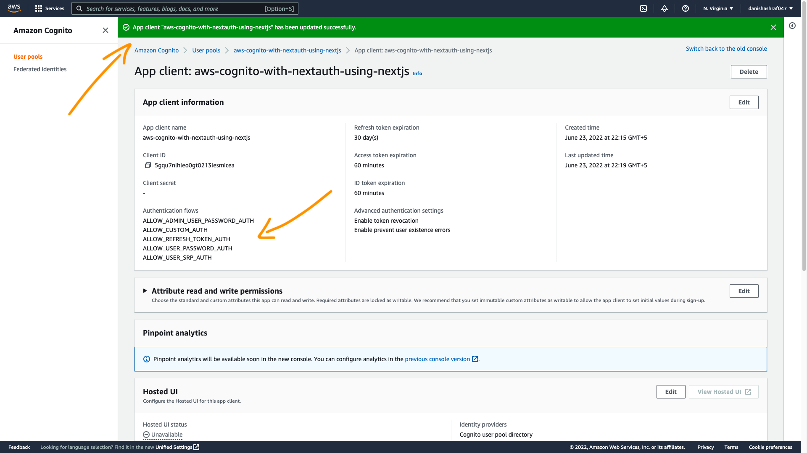](screenshots/screenshot-14.png)

## Assign values in the .env file

There is only a need to assign values on these properties, all the values will get from the AWS console.

- COGNITO_CLIENT_ID
- USER_POOL_ID
- REGION
- AWS_ACCESS_KEY_ID
- AWS_SECRET_ACCESS_KEY

[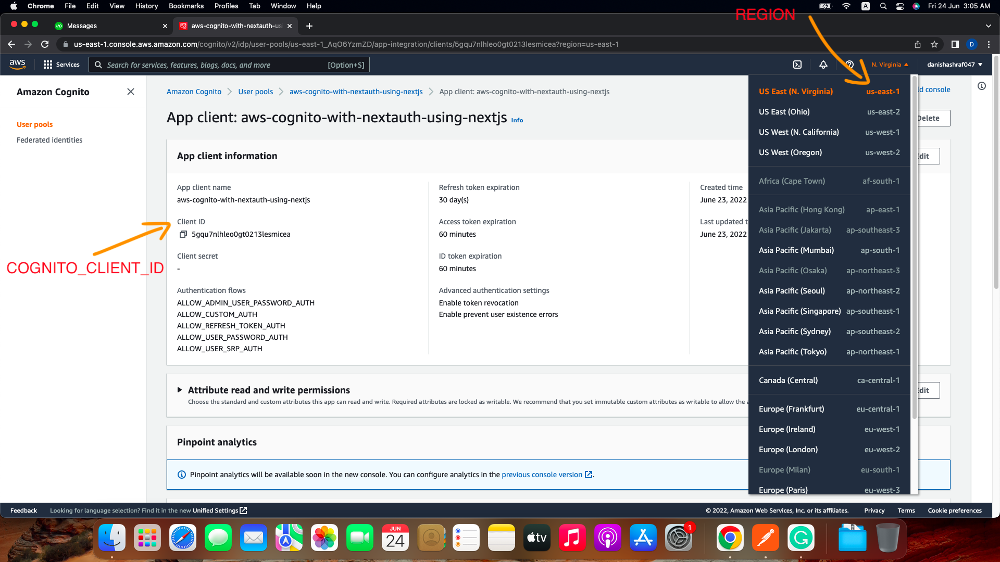](screenshots/screenshot-15.png)
[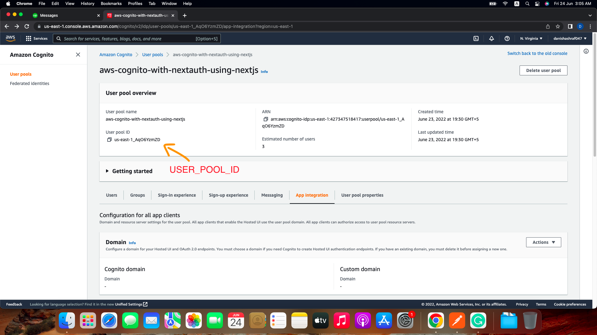](screenshots/screenshot-16.png)
[](screenshots/screenshot-17.png)

## Getting Started

Install project dependencies (for the first when you will clone this repo):

```bash
npm install
```

Run the development server:

```bash
npm run dev
```

Run the production server:

```bash
npm run build
```

```bash
npm run start
```

Run the production based app inside Docker:

```bash
docker build . -t aws-cognito-with-nextauth-using-nextjs
```

```bash
docker run -it -p 8080:3000 aws-cognito-with-nextauth-using-nextjs
```

You will be able to use the from this URL: <http://localhost:8080>

Docker useful commands

```bash
# Show containers
docker container ls

# List images
docker image ls OR docker images -a

# Delete image
docker rmi -f {image-id}

# Build locally
docker build . -t aws-cognito-with-nextauth-using-nextjs

# Run locally
docker run -it -p 8080:3000 aws-cognito-with-nextauth-using-nextjs
```
